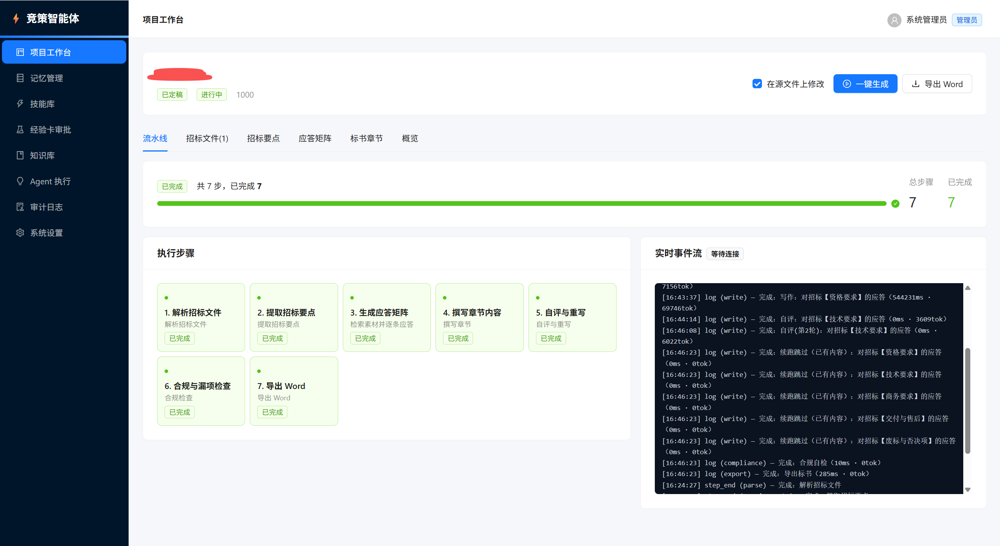
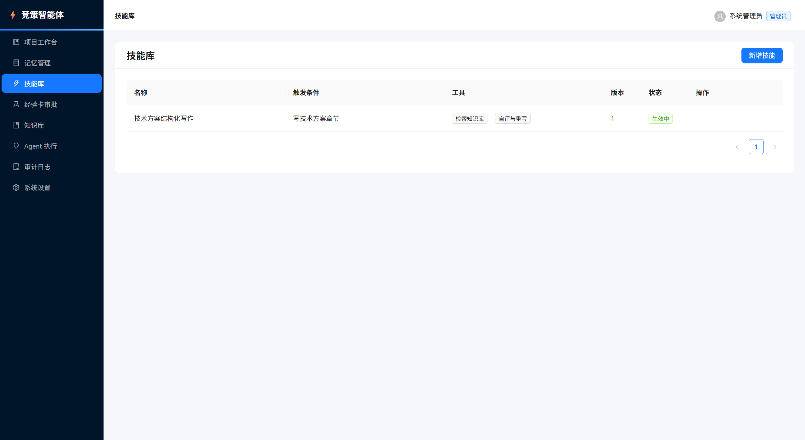

# 竞策智能体（自进化标书 Agent）

一个上传招标文件就能自动生成投标文件、并把每次人工修订转化为自身经验的 AI 投标助手。
核心理念：**一个 Agent + 工具集 + 自进化闭环**，多智能体流水线。

## 界面预览

项目工作台：一键跑通解析 → 要点 → 应答矩阵 → 写作 → 自评 → 合规 → 导出，可勾选「在源文件上修改」。



技能库：沉淀可复用的写作技能（触发条件、工具组合、版本与生效状态）。



## 架构

```
apps/server      NestJS + TypeORM + MySQL/SQLite
apps/web         React 18 + Vite + Ant Design
packages/shared  前后端共享的 Zod schema / 枚举
docs/            设计文档与实现方案（必读）
```

## 快速开始（一条命令，单端口，默认 SQLite 零依赖）

```bash
pnpm install
pnpm dev
```

打开 **http://localhost:3000/** 即是前端页面（同时该端口的 `/api/v1` 为后端接口）。

`pnpm dev` 会：

- 首次构建前端产物，后端自动托管并监听 3000 端口（单端口，无跨域）；
- 前端 `vite build --watch` 监听源码变更自动重建，刷新页面即可看到最新效果；
- 如需 Vite 原生热更新（HMR），另开终端执行 `pnpm dev:web`（http://localhost:5173，已配置 `/api` 代理到后端）。

后端会自动探测 `apps/web/dist` 作为前端目录；也可用环境变量 `WEB_DIST` 显式指定。
如需自定义配置，复制 `apps/server/.env.example` 为 `apps/server/.env` 后再执行 `pnpm dev`。

> 也可匿名用 `pnpm start`，等价于 `pnpm dev`。

默认账号：
- 管理员：`admin / admin123`
- 投标专员：`user / user123`

> 没有 LLM_API_KEY 时，系统自动启用 Mock Provider，离线产出结构完整的演示内容。

## 数据库（SQLite 零依赖 / MySQL 可选）

默认使用内嵌 **SQLite**（`better-sqlite3`），**自动创建数据库目录与文件、自动建表、自动写入种子数据**，无需任何额外安装。

| 配置 | 说明 |
|------|------|
| `DB_TYPE=sqlite` | 默认。使用内嵌 SQLite |
| `SQLITE_FILE=data/dev.db` | 数据库文件路径；相对路径基于启动工作目录，不存在会自动递归创建目录与文件 |
| `DB_TYPE=mysql` | 切换 MySQL 8（`DB_HOST/DB_PORT/DB_USER/DB_PASSWORD/DB_NAME`） |

- SQLite 连接自动启用 `WAL` 日志、外键约束与 5s busy_timeout；
- 表结构通过 TypeORM `synchronize` 自动创建；
- 首次启动自动写入默认租户、管理员账号、示例记忆与技能；
- 启动日志会打印数据库实际文件路径；
- 可访问 `GET /api/v1/system/db` 查看当前驱动、文件路径、文件大小与是否存在。

桌面端本地模式固定使用 SQLite，数据文件位于用户数据目录（见 `desktop/README.md`），首次启动自动创建。

## 模型配置（加密入库）

模型配置存在数据库表 `t_llm_config`，**支持同一租户配置多个模型**，并可指定其中一个为默认；**API Key 使用 AES-256-GCM 加密后落库**，接口与页面只返回脱敏值（如 `****7890`）。

- 加密密钥来自 `APP_SECRET`（未设置时回退 `JWT_SECRET`）；生产务必单独配置并妥善保管，**变更后历史密文将无法解密**。
- 配置优先级：**租户默认启用配置 → 环境变量 → 离线 Mock**；未配置 API Key 时自动回落 Mock，系统离线可运行。
- 管理接口（需 `ADMIN` 角色）：
  - `GET /api/v1/llm-config` 列出全部配置（脱敏）及当前生效项
  - `POST /api/v1/llm-config` 新建
  - `PUT /api/v1/llm-config/:id` 更新（`apiKey` 传空串表示清除，不传表示不变）
  - `DELETE /api/v1/llm-config/:id` 删除（若删的是默认项会自动提升另一条）
  - `POST /api/v1/llm-config/:id/default` 设为默认模型
  - `POST /api/v1/llm-config/test` 连通性测试（可传 `id` 或临时 key/baseUrl）
- 也可在前端「系统设置」页管理多配置、设默认与测试。

## 生产部署

```bash
docker compose up -d
```

环境变量（server）：
- `DB_TYPE=mysql|mysql8` 生产推荐 MySQL
- `LLM_BASE_URL` / `LLM_API_KEY` / `LLM_MODEL` OpenAI 兼容协议
- `JWT_SECRET` 生产务必修改
- `UPLOAD_DIR` 文件上传目录
- `AGENT_AUTO_CONTINUE` 默认 true：跳过人工断点（演示态）

## 桌面端（本地一体化运行时）

无需部署、无需装数据库，安装即用：

```bash
pnpm desktop:install    # 安装桌面端依赖（electron / electron-builder）
pnpm desktop:prepare    # 构建 shared/server/web 并暂存运行时（首次会下载内嵌 Node）
pnpm desktop:dev        # 本地启动桌面端

pnpm desktop:dist       # 打包当前平台安装包 → desktop/release/
```

- **本地模式（默认）**：内嵌 Node 启动后端，SQLite 数据落在用户目录，前端由后端托管，单端口运行。
- **远程模式**：菜单「模式 → 设置远程控制台地址…」切换到远程控制台。
- 详见 [`desktop/README.md`](desktop/README.md)。

不想下载内嵌 Node 时可用 `BIDSTRAT_SKIP_NODE=1 pnpm desktop:prepare`（开发态回退系统 Node）。

## 自动发布（GitHub Actions）

推送 **main / master**（或手动 Run workflow）即自动升版本号并发布。

```bash
git push origin main
# 或：Actions → Release → Run workflow
```

自动完成：
1. 按已有 `v*` / `x.y.z` tag **patch +1**（首次为 `v1.0.0`）；
2. 构建 server / web Docker 镜像，产物含 `*-linux-amd64.tar.gz`，发版时推送到 GHCR  
   （`ghcr.io/<owner>/bidstrat-agent-server`、`bidstrat-agent-web`）；
3. 在 Windows / macOS / Linux 分别打包桌面安装包（NSIS、dmg/zip、AppImage/deb）；
4. 汇总上述产物创建 **GitHub Release**。

PR 与非主干分支只会构建产物，**不推 GHCR、不发 Release**。

日常 CI（`.github/workflows/ci.yml`）在 push / PR 时执行 `pnpm -r typecheck` 与 `pnpm -r build`。

## 自进化闭环

```
人工定稿 → 自动采集 diff & 分类（采纳/小改/大改/重写）
     ↓
项目归档 → 复盘提炼经验卡（PENDING）
     ↓
双门控：评估回归通过 → 人工批准（APPROVED）
     ↓
SEMANTIC_MEMORY / SKILL / EPISODIC_MEMORY 版本升级，旧版 DISABLED
     ↓
一键回滚
```

## 核心理念

> **复杂度必须被真实负载逼出来，而不是被预先设计出来。**
> 在此之前，一个会自我进化的 Agent、一套单体应用、一个 MySQL，就是最好的架构。

## 演进触发

| 触发条件 | 才考虑引入 |
|---|---|
| KB 切块 > 10 万 | MySQL VECTOR / 独立向量库 |
| 解析任务拖垮主进程 | 解析模块拆为 worker |
| 并发生成 > 50 项目 | K8s + 任务队列 |
| 出现真正需要并行异质推理 | 再评估多智能体 |

## 主要 API 速览

## 许可

内部使用。